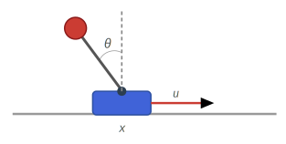

# Cart-Pole Limit Cycle via Symbolic Lagrangian Mechanics

```@meta
Draft = false
```

This tutorial demonstrates how to combine **symbolic derivation of equations of motion** (via
[`Symbolics.jl`](https://symbolics.juliasymbolics.org/)) with **direct optimal control**
(via [OptimalControl.jl](https://control-toolbox.org/OptimalControl.jl/)) to find a
**periodic orbit** (limit cycle) for a cart-pole system.

The key is to define the kinetic and potential energies and the power of the non-conservative forces, and to let `Symbolics.jl` handle the derivations of the equations of motion using the Lagrange-Euler equation.

## The Cart-Pole System

The system consists of a cart of mass ``m_c`` sliding on a frictionless horizontal rail, with
a rigid pendulum of mass ``m_p`` and length ``l`` attached to it. A horizontal force ``u`` (the control input) acts on the cart.

```@raw html
<figure>
  
  <figcaption>Fig. 1 — Cart-pole system. The angle θ is measured from the upright position.</figcaption>
</figure>
```

The configuration vector is ``q = (x,\, \theta)``, where ``x`` is the cart position and
``\theta = 0`` corresponds to the **upright** (unstable) equilibrium of the pendulum.

### Positions

The Cartesian positions of the two bodies are:

```math
p_c = \begin{pmatrix} x \\ 0 \end{pmatrix}, \qquad
p_p = \begin{pmatrix} x + l\sin\theta \\ l\cos\theta \end{pmatrix}.
```

### Lagrangian

The kinetic and potential energies are:

```math
T = \tfrac{1}{2}m_c\,\|\dot{p}_c\|^2 + \tfrac{1}{2}m_p\,\|\dot{p}_p\|^2
  = \tfrac{1}{2}(m_c+m_p)\dot{x}^2
    + m_p l\,\dot{x}\dot{\theta}\cos\theta
    + \tfrac{1}{2}m_p l^2\dot{\theta}^2,
```

```math
V = m_p\,g\,l\cos\theta.
```

The Lagrangian is ``\mathcal{L} = T - V``. The virtual power ``P_{nc}`` of the non-conservative force (control) ``F = (u, 0)`` acting on the cart gives the generalised force vector:

```math
P_{nc} = F \cdot \dot{p}_c = u\,\dot{x},
\quad\Longrightarrow\quad
Q = \frac{\partial P_{nc}}{\partial \dot{q}} = \begin{pmatrix} u \\ 0 \end{pmatrix}.
```

### Euler–Lagrange Equation

The equations of motion follow from:

```math
\frac{d}{dt}\frac{\partial \mathcal{L}}{\partial \dot{q}}
- \frac{\partial \mathcal{L}}{\partial q} = Q.
```

They can be written in the standard **manipulator form** (also known as **robotic equation of motion**):

```math
M(q)\,\ddot{q} = -C(q,\dot{q}) + \tau(q, u),
```

where the symmetric positive-definite **mass matrix** is:

```math
M(q) =
\begin{pmatrix}
  m_c + m_p & m_p l \cos\theta \\
  m_p l \cos\theta & m_p l^2
\end{pmatrix},
```

and the right-hand side collects Coriolis/gravity terms and the control torque. Instead of
deriving these by hand, we rely on `Symbolics.jl` to compute and **analytically invert**
``M(q)`` for us.

### State-Space Form

Defining the state $X = (x,\,\theta,\,\dot{x},\,\dot{\theta})$, the equations of
motion become the first-order system:

```math
\dot{X}(t) = f\!\left(X(t),\, u(t)\right) =
\begin{pmatrix}
  \dot{x} \\ \dot{\theta} \\ M^{-1}(q)\bigl(-C(q,\dot{q}) + \tau(q,u)\bigr)
\end{pmatrix}.
```

# Optimal Control of a Cart-Pole System using Symbolics.jl

This tutorial demonstrates how to use `Symbolics.jl` to automate the derivation of equations of motion (EOM) for a mechanical system and subsequently solve an optimal control problem using `OptimalControl.jl`.

## Implementation

### Setup & Imports

```@example main
using OptimalControl
using NLPModelsIpopt
using Symbolics
using LinearAlgebra: dot
using Plots
```

### Physical Parameters and Symbolic Variables

We declare all parameters both as numerical constants (for the final function evaluation) and as symbolic variables (for the Lagrangian computation). We define the configuration vector ``q = (x, \theta)``.

```@example main
# Physical constants
const m_c_val = 5.0
const m_p_val = 1.0
const l_val   = 2.0
const g_val   = 9.81
const tf_val  = 2.0

# Symbolic variables
@variables t
D = Differential(t)
@variables m_c m_p l g u
@variables x(t) θ(t)

q = [x, θ]

nothing # hide
```

### Automated Kinematics and Lagrangian

We express the positions, kinetic energy, potential energy, and (non-conservative) power symbolically. The time derivatives ``\dot{p}_c`` and ``\dot{p}_p`` are computed automatically by `D.(...)`.

```@example main
p_c = [x, 0.0]
p_p = [x + l * sin(θ), l * cos(θ)]
F_ext = [u, 0.0]

T = 0.5 * m_c * sum(abs2, D.(p_c)) + 0.5 * m_p * sum(abs2, D.(p_p))
V = g * (m_p * p_p[2])
L = T - V

P_non_conservative = dot(D.(p_c), F_ext)
nothing # hide
```

### Euler–Lagrange Equations and Mass-Matrix Inversion

Starting from ``\mathcal{L} = T - V``, `Symbolics.jl` computes the terms of the Euler–Lagrange equations. To isolate the accelerations, we substitute the symbolic time derivatives with algebraic variables. This allows us to identify the **standard manipulator form** components: the mass matrix is the Jacobian of the residual with respect to the accelerations ``\ddot{q}``, and the bias vector contains the remaining terms.

```@example main
A = D.(Symbolics.gradient(L, D.(q)))
B = Symbolics.gradient(L, q)
Q = Symbolics.gradient(P_non_conservative, D.(q))

# Euler-Lagrange residual: d/dt(∂L/∂q̇) - ∂L/∂q - Q = 0
el_eqs = expand_derivatives.(A - B - Q)

# Helper to create algebraic variables for derivatives
diff_var(qi, suffix) = Symbolics.variable(Symbol(Symbolics.operation(Symbolics.value(qi)), suffix))

# Static aliases for velocities and accelerations
v = diff_var.(q, :_t)
dv = diff_var.(q, :_tt)

# Freeze time derivatives into static algebraic variables
sub_rules = Dict([D.(q) .=> v; D.(D.(q)) .=> dv])
residual = Symbolics.substitute.(el_eqs, (sub_rules,))

# Identify mass matrix M and bias vector b such that M·dv + b = 0
mass = Symbolics.jacobian(residual, dv)
bias = Symbolics.substitute.(residual, (Dict(dv .=> 0.0),))

# Solve for accelerations analytically: dv = M⁻¹(-b)
accel = Symbolics.simplify_fractions.(mass \ (-bias))

# Fully explicit state derivative: Ẋ = [v, accel]
X = [q; v]
dX = [v; accel]
nothing # hide
```

### Code Generation

`build_function` compiles the symbolic expression `dX` into a native Julia function with arguments `X`, `u`, and parameter values. The `force_SA=true` flag generates a **StaticArrays** kernel, which avoids heap allocations inside the ODE right-hand side — crucial for solver performance because dimension is small. For larger problems (``X \in \mathrm{R}^n``, ``n > 100``), we would use a mutating dynamics function instead, cf. [Julia Performance Tips](https://docs.julialang.org/en/v1/manual/performance-tips/#Consider-StaticArrays.jl-for-small-fixed-size-vector/matrix-operations).

```@example main
f_expr = build_function(dX, X, u, [m_c, m_p, l, g];
    expression=Val{false}, force_SA=true)
f_sym = f_expr[1]   # out-of-place variant: (state, u, params) → SVector

const p_vals  = [m_c_val, m_p_val, l_val, g_val]

cartpole_dynamics(X, u) = f_sym(X, u, p_vals)
nothing # hide
```

### Optimal Control Problem Definition

We now formulate the optimal control problem using the `@def` macro from `OptimalControl.jl`. The initial state is not at rest because ``ω(0) = 0.2``, while the boundary condition ``X(0) - X(tf) = 0`` encodes the periodicity of the orbit.

```@example main
@def cartpole begin
    t ∈ [0, tf_val], time
    X = (x, θ, v, ω) ∈ R⁴, state
    u ∈ R, control

    x(0) == 0
    θ(0) == 0
    v(0) == 0
    ω(0) == 0.2
    X(tf_val) - X(0) == [0, 0, 0, 0]  # Periodic orbit

    Ẋ(t) == cartpole_dynamics(X(t), u(t))

    ∫(u(t)^2) → min
end
```

### Solving the NLP

The problem is transcribed into a nonlinear program using direct collocation on a uniform grid of 100 intervals, then handed to `Ipopt` via `NLPModelsIpopt.jl`. We provide a simple initial guess for the state and control trajectories. See [the documentation](@extref OptimalControl manual-solve) for more information.

```@example main
initial_guess = @init cartpole begin
    X(t) := [0.0, 0.0, 0.0, 0.2]
    u(t) := 0.0
end

sol = solve(cartpole; display=false, grid_size=100, init=initial_guess)
```

### Results

```@example main
tsol = time_grid(sol)
Xsol = state(sol).(tsol)
usol = control(sol).(tsol)

X_mat = reduce(hcat, Xsol)
q_sol = X_mat[1:2, :]'
dq_sol = X_mat[3:4, :]'

p1 = plot(tsol, q_sol, label=["x" "θ"], title="Configuration")
p2 = plot(tsol, dq_sol, label=["v" "ω"], title="Velocities")
p3 = plot(tsol, usol, label="u", title="Control", linetype=:steppost)

plot(p1, p2, p3, layout=(3, 1), size=(800, 700))
```

The plots show the cart position ``x`` and pendulum angle ``\theta``, the corresponding velocities, and the optimal control force ``u`` required to stabilize the system back to its initial state within 2 seconds.

### Animation

The animation below shows the cart-pole evolving along the optimal limit-cycle trajectory. The blue cart slides on the horizontal rail while the pendulum swings around the upright equilibrium.

```@setup main
# Extract states for the animation
xsol = X_mat[1, :]
θsol = X_mat[2, :]

# Serialise trajectory for JS (manual, no extra dependencies)
json_t  = "[" * join(string.(tsol),  ",") * "]"
json_x  = "[" * join(string.(xsol),  ",") * "]"
json_th = "[" * join(string.(θsol),  ",") * "]"

# Define a wrapper to instruct Documenter to render the output as HTML
struct RawHTML
    raw::String
end
Base.show(io::IO, ::MIME"text/html", h::RawHTML) = print(io, h.raw)

html_anim = """
<div style="display: flex; justify-content: center; margin: 20px 0;">
    <canvas id="cartpoleCanvas" width="900" height="300" 
            style="border:1px solid #ddd; border-radius: 8px; max-width: 100%;">
    </canvas>
</div>

<script>
(function() {
    // Julia directly interpolates the arrays into the JS here
    const t = $json_t;
    const x = $json_x;
    const th = $json_th;
    
    const canvas = document.getElementById('cartpoleCanvas');
    const ctx = canvas.getContext('2d');
    
    // Detect dark/light mode
    const isDark = window.matchMedia && window.matchMedia('(prefers-color-scheme: dark)').matches;
    
    // Color palettes
    const colors = isDark ? {
        canvas_bg: '#1e1e2e',
        track: '#4a4a4a',
        cart: '#4063D8',
        pole: '#CB3C33',
        hinge: '#ecf0f1',
        bob: '#CB3C33',
        progress_bg: '#3a3a3a',
        progress: '#4063D8'
    } : {
        canvas_bg: '#fafafa',
        track: '#999',
        cart: '#4063D8',
        pole: '#555',
        hinge: '#2c3e50',
        bob: '#CB3C33',
        progress_bg: '#ecf0f1',
        progress: '#4063D8'
    };
    
    const scale = 50; 
    const l_px = $(l_val) * scale; 
    const duration = t[t.length - 1];

    let start_time = null;

    function draw(time) {
        if (!start_time) start_time = time;
        
        // Seamless periodic loop
        let elapsed = time - start_time;
        let sim_t = (elapsed / 1000.0) % duration;
        
        // Find the current time interval
        let i = 0;
        while(i < t.length - 1 && t[i + 1] < sim_t) { i++; }

        // Linear interpolation for buttery smooth frames
        let dt = t[i+1] - t[i];
        let alpha = (dt > 0) ? (sim_t - t[i]) / dt : 0;
        let cur_x = x[i] + alpha * (x[i+1] - x[i]);
        let cur_th = th[i] + alpha * (th[i+1] - th[i]);

        ctx.fillStyle = colors.canvas_bg;
        ctx.fillRect(0, 0, canvas.width, canvas.height);
        
        const cx = canvas.width / 2 + cur_x * scale;
        const cy = canvas.height / 2 + 40; 

        // Draw Track
        ctx.beginPath();
        ctx.moveTo(0, cy + 15);
        ctx.lineTo(canvas.width, cy + 15);
        ctx.lineWidth = 2;
        ctx.strokeStyle = colors.track;
        ctx.stroke();

        // Draw Cart
        ctx.fillStyle = colors.cart;
        ctx.fillRect(cx - 30, cy - 15, 60, 30);
        
        // Draw Pole
        const px = cx + l_px * Math.sin(cur_th);
        const py = cy - l_px * Math.cos(cur_th);
        
        ctx.beginPath();
        ctx.moveTo(cx, cy);
        ctx.lineTo(px, py);
        ctx.lineWidth = 6;
        ctx.lineCap = 'round';
        ctx.strokeStyle = colors.pole;
        ctx.stroke();
        
        // Draw Hinge
        ctx.beginPath();
        ctx.arc(cx, cy, 6, 0, 2 * Math.PI);
        ctx.fillStyle = colors.hinge;
        ctx.fill();

        // Draw Bob
        ctx.beginPath();
        ctx.arc(px, py, 8, 0, 2 * Math.PI);
        ctx.fillStyle = colors.bob;
        ctx.fill();

        // Draw Progress Bar at the very bottom
        const bar_height = 4;
        ctx.fillStyle = colors.progress_bg;
        ctx.fillRect(0, canvas.height - bar_height, canvas.width, bar_height);
        ctx.fillStyle = colors.progress; // Active progress
        ctx.fillRect(0, canvas.height - bar_height, canvas.width * (sim_t / duration), bar_height);

        requestAnimationFrame(draw);
    }
    requestAnimationFrame(draw);
})();
</script>
"""
```

```@example main
RawHTML(html_anim)  # hide
```
